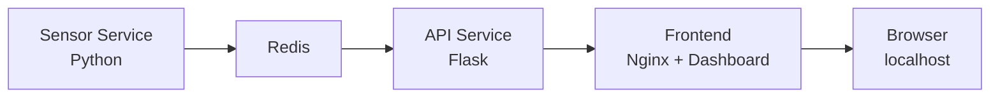

# Docker Sensore Dashboard

Mini progetto full-stack containerizzato con Docker Compose che simula un sensore ambientale, salva i dati su Redis, li espone tramite API Flask e li visualizza in una dashboard web con Nginx e Chart.js.

## Obiettivo

Questo progetto mostra una piccola architettura multi-servizio con:

- generazione dati sensore simulati;
- persistenza temporanea su Redis;
- API REST in Flask;
- frontend statico servito da Nginx;
- dashboard con KPI, storico letture e grafico live;
- configurazione tramite file `.env`;
- healthcheck Redis e dipendenze robuste in Docker Compose.

## Stack

- Docker Compose
- Python
- Flask
- Redis
- Nginx
- HTML / CSS / JavaScript
- Chart.js

## Architettura



## Struttura del progetto

```text
docker-sensore/
├── api/
│   ├── api.py
│   ├── Dockerfile
│   └── requirements.txt
├── frontend/
│   ├── index.html
│   ├── nginx.conf
│   └── Dockerfile
├── sensor/
│   ├── sensor.py
│   ├── Dockerfile
│   └── requirements.txt
├── .env.example
├── docker-compose.yml
└── README.md
```

## Variabili d'ambiente

Crea un file `.env` nella root del progetto.

Esempio:

```env
REDIS_HOST=redis
REDIS_PORT=6379
SENSOR_INTERVAL=2
TEMPERATURE_MIN=15.0
TEMPERATURE_MAX=30.0
HUMIDITY_MIN=30.0
HUMIDITY_MAX=80.0
```

## Avvio del progetto

Build e avvio:

```bash
docker compose up -d --build
```

Verifica stato container:

```bash
docker compose ps
```

Stop progetto:

```bash
docker compose down
```

Stop progetto e rimozione volumi:

```bash
docker compose down -v
```

## Accesso applicazione

Frontend dashboard:

- [http://localhost](http://localhost)

API:

- [http://localhost/api](http://localhost/api)
- [http://localhost/api/health](http://localhost/api/health)
- [http://localhost/api/last-reading](http://localhost/api/last-reading)
- [http://localhost/api/history](http://localhost/api/history)
- [http://localhost/api/history?limit=5](http://localhost/api/history?limit=5)

## Funzionalità implementate

- sensore simulato con valori casuali di temperatura e umidità;
- salvataggio ultima lettura e storico su Redis;
- endpoint API per lettura singola, storico e health;
- dashboard con:
  - stato API,
  - temperatura corrente,
  - umidità corrente,
  - storico ultime letture,
  - grafico live;
- soglie visive per KPI;
- configurazione tramite `.env`;
- healthcheck Redis con `depends_on: service_healthy`.

## Esempio risposta API

### `/api/last-reading`

```json
{
  "timestamp": "2026-07-18T16:25:10",
  "temperatura": 21.84,
  "umidita": 48.11
}
```

### `/api/history?limit=3`

```json
{
  "count": 3,
  "limit": 3,
  "storico_letture": [
    {
      "timestamp": "2026-07-18T16:24:40",
      "temperatura": 20.31,
      "umidita": 50.12
    }
  ]
}
```

## Note tecniche

- Redis è usato come storage in-memory per semplicità.
- Il frontend comunica con Flask tramite reverse proxy Nginx su `/api/`.
- Il sensore scrive anche un log locale montato via volume bind.
- Il progetto è pensato come base portfolio e come punto di partenza per future estensioni.

## Estensioni future

- persistenza storica su database relazionale;
- autenticazione API;
- esportazione dati CSV;
- filtri temporali nello storico;
- deploy cloud o VPS;
- monitoraggio e logging più avanzati.